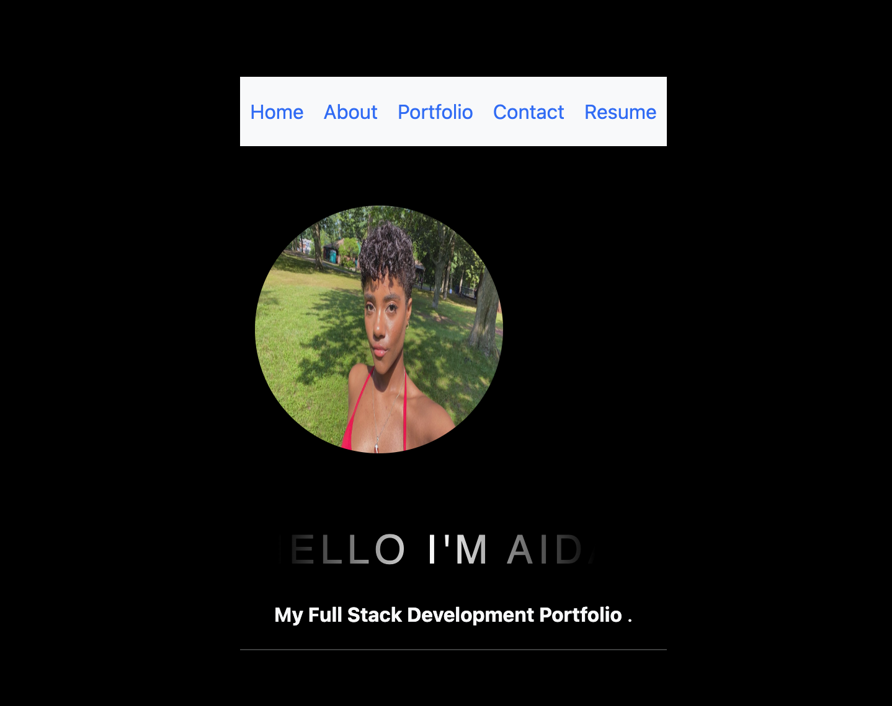

# React-Portfolio

## Description

This My React Portfolio, here you will find a few of my projects, a way to contact me, my resume and a bit About myself 

## Technologies Used

<a href="https://reactjs.org/docs/getting-started.html">React</a>

<a href="https://getbootstrap.com/docs/4.1/getting-started/introduction/">Bootstrap</a>

<a href="https://cdnjs.com/libraries/font-awesome">Font Awesome</a>

<a href="https://www.npmjs.com/package/dotenv">dotenv</a>

## live link

<a href="https://reactjs.org/docs/getting-started.html">Portfolio</a>

